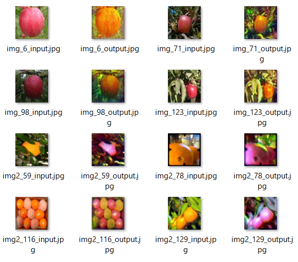

# apple2orange-cyclegan
Perform image conversion of apple2orange dataset with Cycle-GAN and ruby-dnn.



# Try
### Preparing for required installation
* [ruby-dnn](https://github.com/unagiootoro/ruby-dnn)
* [numo-linalg](https://github.com/ruby-numo/numo-linalg)
* [rubyzip](https://github.com/rubyzip/rubyzip)

### Clone repository
```
$ git clone https://github.com/unagiootoro/facade-pix2pix
```

### Start image conversion
```
$ ruby imgen.rb
```

### When performing full training
```
$ ruby train.rb
$ ruby make_data.rb
$ ruby imgen.rb
```
